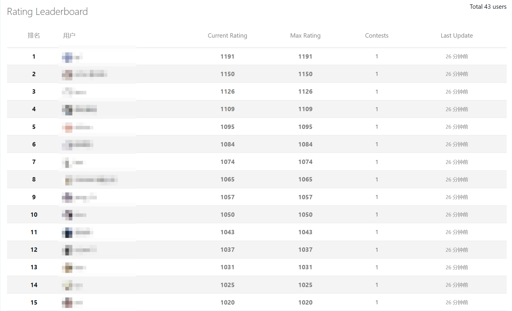
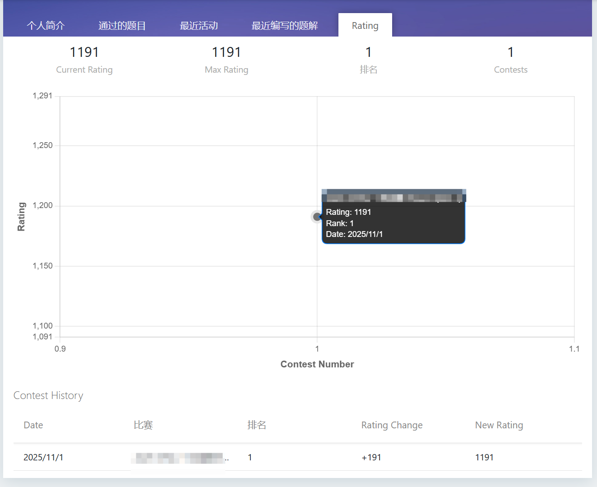
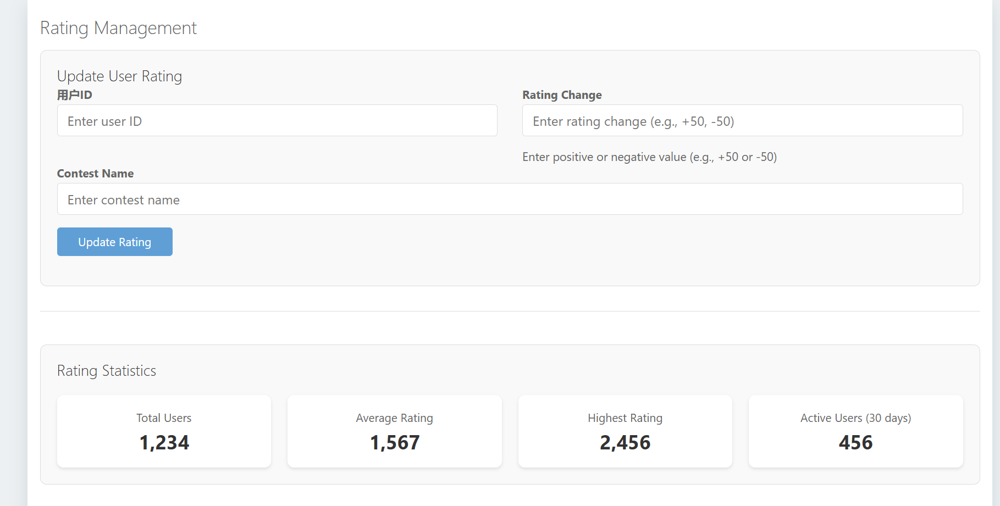
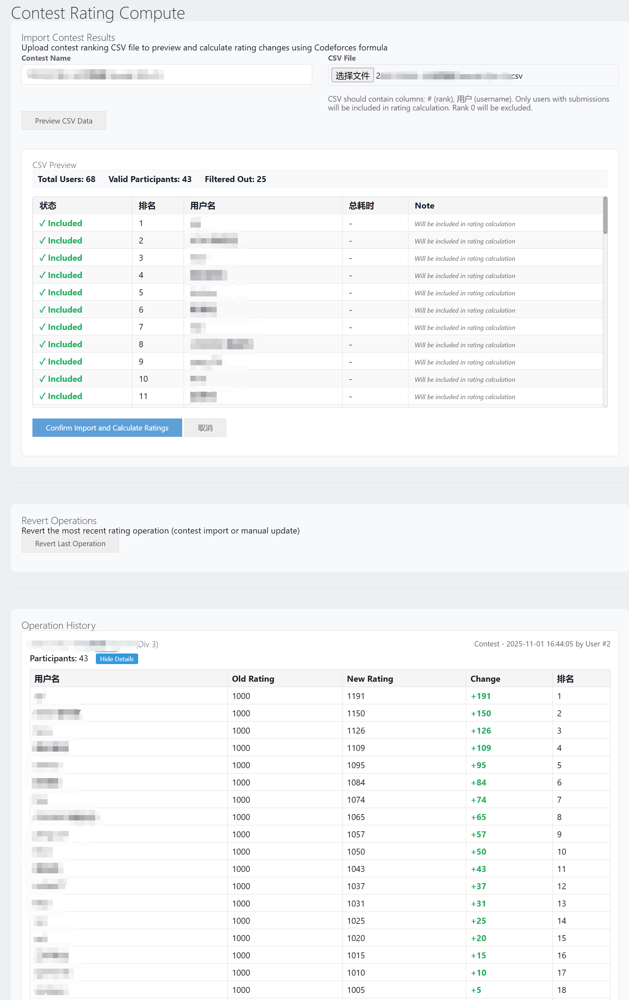
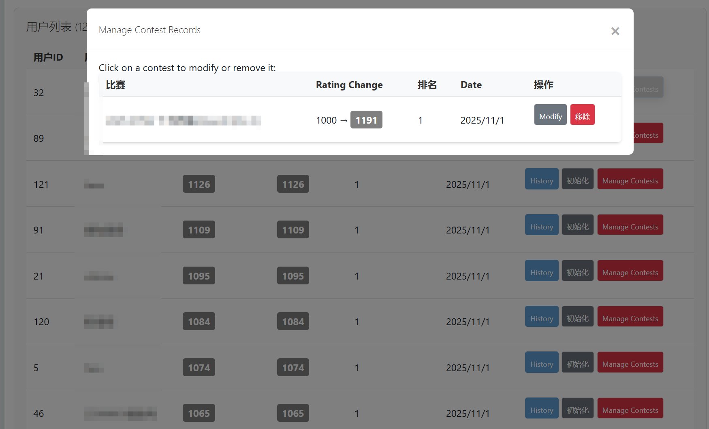

# HydroOJ Rating System Plugin

## 概述

HydroOJ Rating System Plugin 是一个为 HydroOJ 在线评测系统开发的评级系统插件。该插件提供了完整的用户评级管理功能，包括评级排行榜、用户评级历史记录、管理员评级管理工具等。

> 如果觉得好用请给我一个Star，不胜感激！
>
> 佛系更新，有bug可以提issue。

## 功能特性

### 🏆 核心功能

1. **用户评级系统**

   - 用户评级计算和更新
   - 最高评级记录
   - 参赛次数统计
   - 评级历史追踪
2. **评级排行榜**

   - 全站评级排行榜
   - 分页显示（每页50条记录）
   - 只显示至少参加过1次比赛的用户
   - 实时排名计算
3. **用户评级详情页**

   - 个人评级信息展示
   - 评级历史图表
   - 参赛历史记录
   - 排名信息

### 🛠️ 管理功能

1. **评级管理**

   - 手动调整用户评级
   - 支持正负评级变化（±1000范围内）
   - 操作记录和审计
   - 评级统计信息
2. **比赛评级计算**

   - CSV文件导入比赛结果
   - 批量评级计算和更新
   - 操作存档和历史记录
   - 错误处理和验证
3. **用户评级管理**

   - 批量用户评级初始化
   - 用户搜索和筛选
   - 用户数据导出
   - 批量操作工具

## 路由和页面

### 公共访问路由

- `/rating` - 评级排行榜
- `/user/:uid/rating` - 用户评级详情页
- `/api/rating/stats` - 评级统计API
- `/api/rating/user/:uid` - 用户评级数据API
- `/api/user/:uid/info` - 用户信息API

### 管理员路由

- `/manage/rating` - 评级管理页面
- `/manage/user-rating` - 用户评级管理页面
- `/manage/rating/contest` - 比赛评级计算页面

## 模板文件

### 用户界面模板

- `rating_list.html` - 评级排行榜页面
- `user_rating.html` - 用户评级详情页面
- `partials/user_detail/rating.html` - 用户详情页评级部分

### 管理界面模板

- `rating_manage.html` - 评级管理页面
- `user_rating_manage.html` - 用户评级管理页面
- `contest_rating_compute.html` - 比赛评级计算页面

## 安装和配置

### 安装

```bash
sudo su
cd /root/.hydro/
git clone https://github.com/SummerofOrange/hydrooj-rating-system
hydrooj addon add /root/.hydro/hydrooj-rating-system
pm2 restart hydrooj

```

## 使用方法

### 用户功能

#### **查看排行榜**：访问 `/rating` 页面查看全站评级排行榜

rating页面可以通过首页的顶端进入。

至少要参加过一场比赛才会被纳入排行榜。支持根据rating来显示名称颜色，(≥2400、≥2100、≥1900、≥1600、≥1400、≥1200、<1200)对应不同颜色。



#### **查看个人评级**：在用户详情页的"Rating"标签页查看个人评级信息和历史

在个人信息处新增一页Rating的Tab。



#### **评级历史**：查看详细的评级变化历史和参赛记录

### 管理员功能

以下功能均位于控制面板的右侧栏目中。

#### **手动添加比赛评级**：

- 访问 `/manage/rating` 页面
- 输入用户ID、评级变化值和比赛名称
- 提交表单完成评级调整

> 下面的状态栏是美化用的，没有实际计算（



#### **导入比赛结果自动计算Rating**：

- 访问 `/manage/rating/contest` 页面
- 上传CSV格式的比赛结果文件(由比赛排行榜页面导出的csv)，支持预览导入的排名
- 系统自动计算并更新所有参赛者的评级
- 支持撤回最近一次比赛的Rating
- 支持查看所有历史比赛的数据

> Rating计算公式严格使用Codeforces的规则，此外，打星和无任何提交的选手将不会纳入计算。



#### **用户评级管理**：

- 访问 `/manage/user-rating` 页面
- 搜索和筛选用户
- 执行批量操作
- 允许单独取消某次比赛用户的rating得分



## 权限要求

### 用户权限

- `PERM.PERM_VIEW_RANKING` - 查看排行榜权限

### 管理员权限

- `PRIV.PRIV_EDIT_SYSTEM` - 系统编辑权限（管理评级）

## 技术特性

### 前端技术

- Chart.js 用于评级历史图表
- 响应式设计，支持移动端
- Ajax 异步数据加载
- 实时用户搜索和验证

### 后端技术

- TypeScript 开发
- MongoDB 数据存储
- 完整的错误处理和验证
- 操作审计和日志记录

## 贡献

欢迎提交 Issue 和 Pull Request 来改进这个插件。

## 许可证

本项目采用 MIT 许可证。详情请查看 LICENSE 文件。
