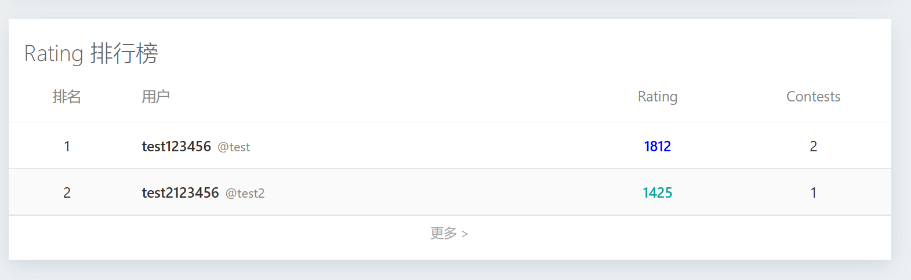
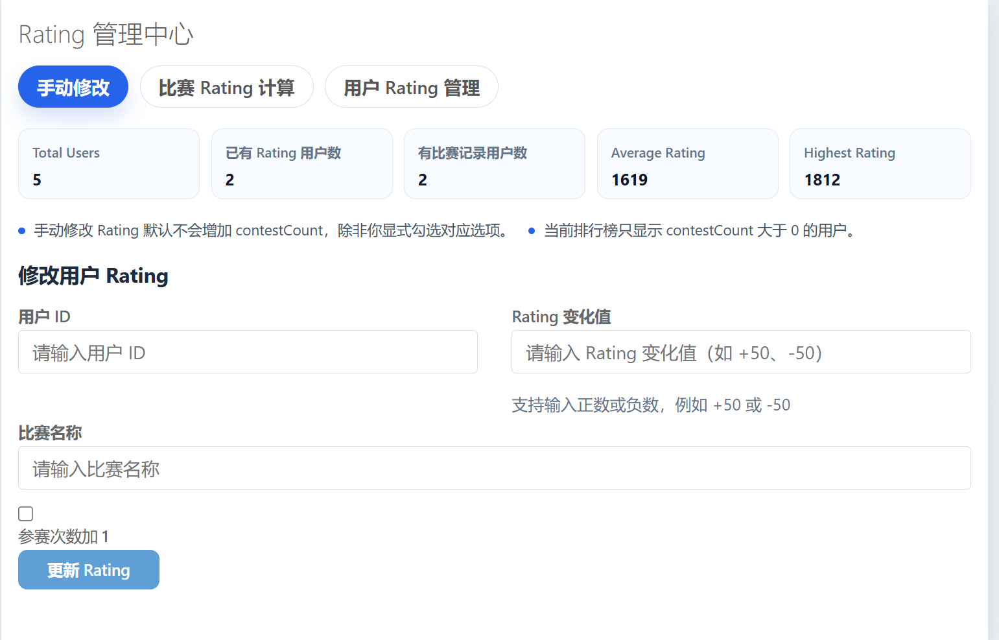
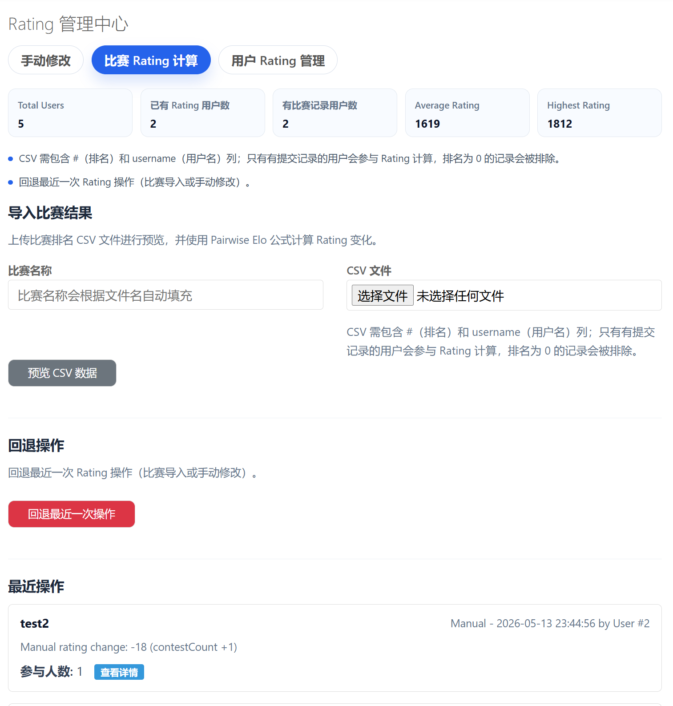
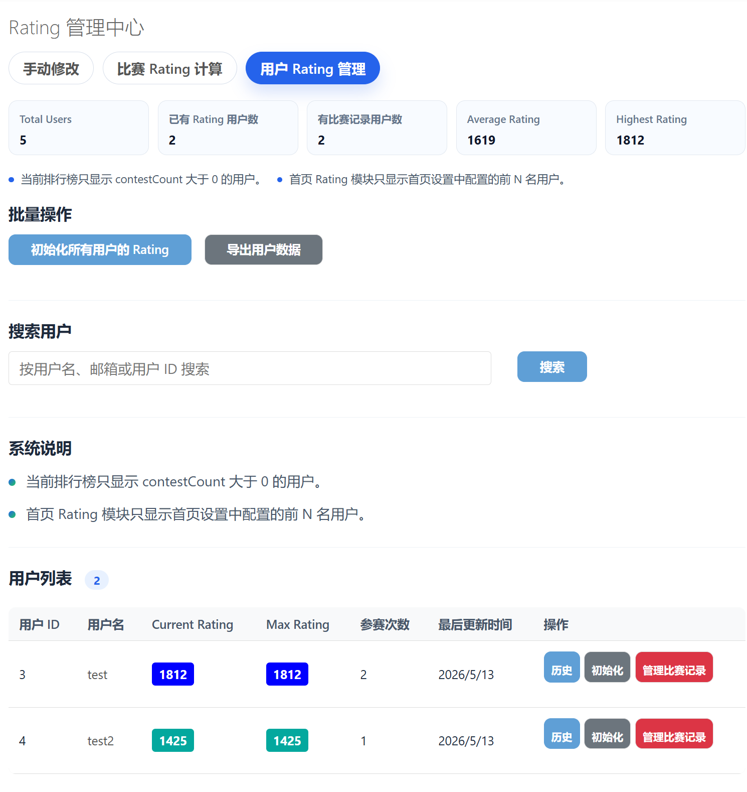

# HydroOJ Rating System Plugin

HydroOJ 的 Rating 插件，提供：

- `Rating 排行榜`
- `用户个人 Rating 页面`
- `首页 Rating 排行模块`
- `Rating 管理中心`

## 安装

```bash
git clone https://github.com/s7win99/hydrooj-rating-system
hydrooj addon add /path/to/hydrooj-rating-system
pm2 restart hydrooj
```

安装后建议强制刷新浏览器缓存。

## 主要功能

### 用户侧

- 访问 `/rating` 查看 `Rating 排行榜`
- 访问 `/user/:uid/rating` 查看用户个人 Rating 页面
- 在用户详情页查看 Rating 卡片

### 首页模块

插件支持首页显示 Rating 排行模块：

- 模块名：`rating_ranking`
- 数据接口：`/api/rating/top`

接口支持参数：

- `limit`
  - 默认 `10`
  - 最大 `50`



### 管理侧

统一入口：

- `/manage/rating-center`

包含 3 个标签页：

- `手动修改`

- `比赛 Rating 计算`

- `用户 Rating 管理`



兼容旧路由：

- `/manage/rating`
- `/manage/rating/contest`
- `/manage/user-rating`

这些旧路由会自动跳转到新的管理中心。

## 首页配置

如果要在 HydroOJ 首页显示插件的 Rating 排行模块，请在：

`管理域 -> 编辑域资料 -> 首页设置`

中把原来的：

```yaml
ranking: 20
```

改成：

```yaml
rating_ranking: 10
```

说明：

- `rating_ranking` 是插件首页模块名
- `10` 表示显示前 10 名
- 可设置范围为 `1` 到 `50`

## 排行榜规则

- 排行榜默认只显示 `contestCount > 0` 的用户
- 手动修改 Rating 不会自动增加 `contestCount`
- 如果需要让用户满足排行榜条件，可在手动修改时勾选：
  - `参赛次数加 1`

## Rating 颜色规则

| Rating 区间 | 颜色 |
| --- | --- |
| `< 1200` | 灰色 |
| `1200 - 1399` | 绿色 |
| `1400 - 1599` | 青蓝色 |
| `1600 - 1899` | 蓝色 |
| `1900 - 2099` | 紫色 |
| `2100 - 2399` | 橙色 |
| `>= 2400` | 红色 |

## 路由

### 页面

- `/rating`
- `/user/:uid/rating`
- `/manage/rating-center`

### API

- `/api/rating/stats`
- `/api/rating/top`
- `/api/rating/user/:uid`
- `/api/user/:uid/info`

## 权限

### 用户权限

- `PERM.PERM_VIEW_RANKING`

### 管理员权限

- `PRIV.PRIV_EDIT_SYSTEM`

## 说明

- 首页排行模块和 `/api/rating/top` 使用插件内部 Rating 数据
- 首页排行榜不会使用 HydroOJ 原生 `ranking`
- 管理中心只修改插件，不修改 HydroOJ 核心源码

## License

MIT
